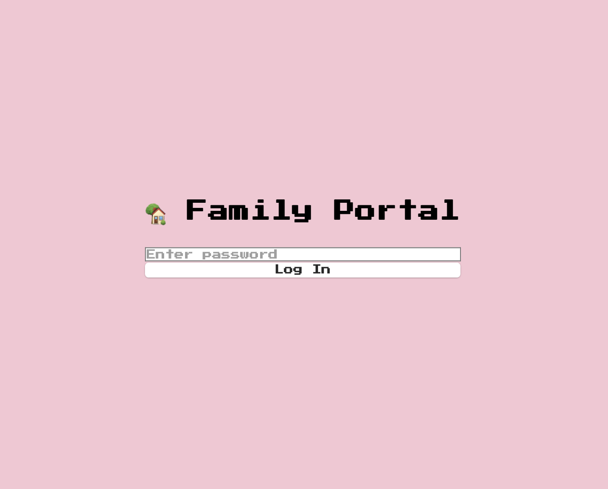
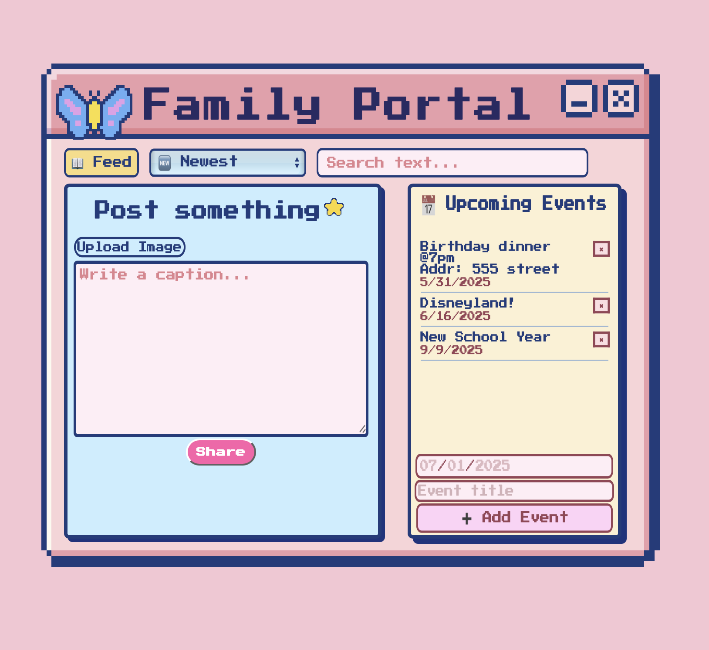

# Family Portal

A private web app built with React and Tailwind CSS that allows a small group of users (e.g., a family) to:
- Log in with a shared passcode
- Post text and images (up to 5 per post)
- View, filter, and delete posts
- Add and scroll through upcoming events
---
## Features

- Minimal login system (passcode)
- Post form with caption and image preview
- "See more" functionality for long captions
- Events list calendar with scrollable, deletable entries
- Filters for newest, oldest, images-only, or text-only posts
- Local data storage via `localStorage` (no backend)
---
## Tech Stack

- React.js (Vite)
- Tailwind CSS
- LocalStorage
- Deployed as a static site
---
## Setup

- ```bash 
- Run `npm install`
- Create a `.env` file and set `VITE_APP_SECRET_PASSWORD=yourpassword` (ex. test123)
- Run `npm run dev`



